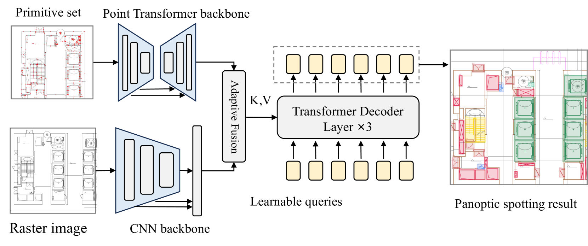

<h2 align="center">ArchCAD-400k: A Large-Scale CAD drawings Dataset and New Baseline for Panoptic Symbol Spotting
</h2>
 
<p align="center">
  
</p>
 
<div align="center">
 
[](https://arxiv.org/abs/2503.22346)  [](https://github.com/ArchiAI-LAB/ArchCAD)  [](https://huggingface.co/datasets/jackluoluo/ArchCAD)  [](LICENSE)
 
</div>


## 🌟 News
- **2025/10/16:** Source code of **DPSS** is released !
- **2025/10/16:** First round of open source of **ArchCAD** Dataset !
- **2025/10/9:** Our project homepage is released ! 
- **2025/9/19:** Our paper is accepted in **NeurIPS 2025** !  🎉


## 📖 Abstract
This repository contains the official implementation of **Dual-Pathway Symbol Spotter (DPSS)**, a new baseline model for panoptic symbol spotting in architectural CAD drawings, which was introduced in our paper "ArchCAD-400K: An Open Large-Scale Architectural CAD Dataset and New Baseline for Panoptic Symbol Spotting". For more information about the project, please refer to our <a href="https://archiai-lab.github.io/ArchCAD.github.io/" style="text-decoration: underline;">Project Page</a>. 

## 🔥 Highlights
- **ArchCAD-400K**: The first large-scale architectural CAD dataset with 400K+ symbols
- **DPSS Model**: Novel dual-pathway architecture for panoptic symbol spotting
- **Comprehensive Evaluation**: Extensive experiments and benchmarks
- **Open Source**: Both dataset and model code are publicly available

## 🔧Installation & Dataset
### Environment

We provide an installation script to set up all dependencies:

```bash
bash install.sh
```

Download the required pretrained model weights:

```bash
cd svgnet/pretrained
bash install.sh
```

### Dataset&Preprocess

#### ArchCAD-400K

We are pleased to announce the initial public release of the ArchCAD dataset. This first batch opens a curated subset of 40K high-quality samples, representing a more refined portion of the full collection. This release aims to facilitate preliminary research, with plans for subsequent releases in the future. Please visit our <a href="https://huggingface.co/datasets/jackluoluo/ArchCAD" style="text-decoration: underline;">HuggingFace</a> page and download the dataset.


#### FloorplanCAD 

download dataset from floorplan website, and convert it to json format data for training and testing.


```python
# download dataset
python dataset/download_data.py
# preprocess
## train, val, test
python dataset/parse_FpCAD_svg.py  --data_dir ./dataset/FloorplanCAD/train/svg_gt --output_dir ./dataset/FloorplanCAD/train/json
python dataset/parse_FpCAD_svg.py  --data_dir ./dataset/FloorplanCAD/val/svg_gt --output_dir ./dataset/FloorplanCAD/val/json
python dataset/parse_FpCAD_svg.py  --data_dir ./dataset/FloorplanCAD/test/svg_gt --output_dir ./dataset/FloorplanCAD/test/json

## dataset_split.json
python FloorplanCAD/dataset_split.py 
```

## 🚀Quick Start

```bash 
# train
bash tools/train_dist.sh
# test
bash tools/test_dist.sh

```


## TODO list:
- [ ] Release our tools **CADParser** for CAD processing.
- [ ] Release a highly optimized version of **DPSS** Framework.

## Acknowledgement
We sincerely thank the authors of [CADTransformer](https://github.com/VITA-Group/CADTransformer), [SymPoint](https://github.com/nicehuster/SymPoint), [SymPointV2](https://github.com/nicehuster/SymPointV2) for their inspiring open-source contributions.
We also thank all engineers and researchers involved in the data annotation, compilation, and review process.


## 📌 Citation

If you find this work useful in your research, please consider citing:

```bibtex
@article{luo2025archcad,
  title={ArchCAD-400K: An Open Large-Scale Architectural CAD Dataset and New Baseline for Panoptic Symbol Spotting},
  author={Luo, R and Liu, Z and Cheng, T and others},
  journal={arXiv preprint arXiv:2503.22346},
  year={2025}
}
```
